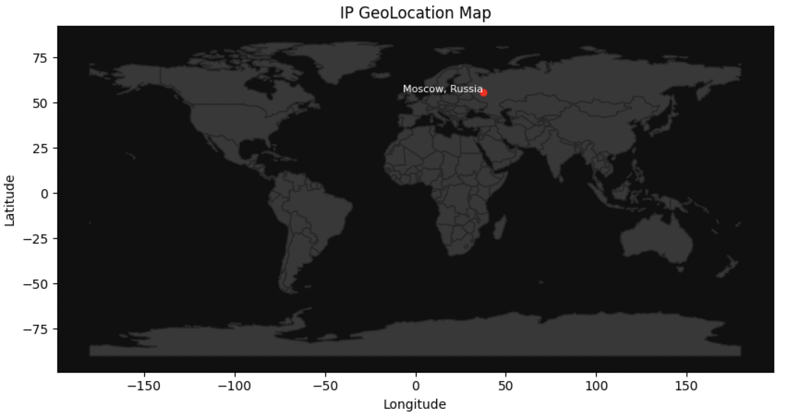
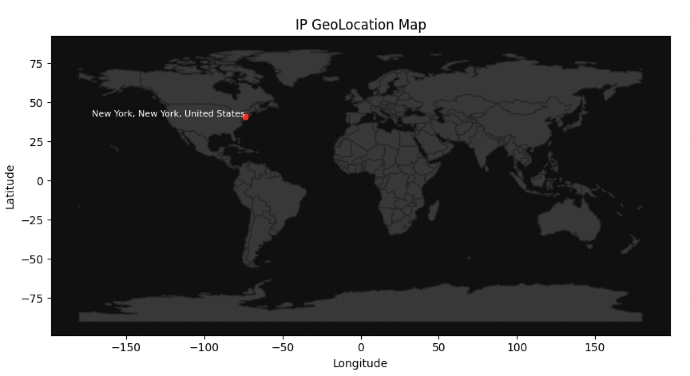

# IPLocator

<p align='center'></p>
<br>

### Description

Use IPLocator to extract metadata including geolocation information from domain names and IPv4 addresses.

---

### Examples

#### Search by IP Address
```
 python iplocator.py --ip 185.46.85.45
```
<p></p>

```
{
    "ip": "185.46.85.45",
    "hostname": null,
    "domain_name": "Unknown host",
    "is_private": false,
    "org": "AS35624 Silverstar Invest Limited",
    "city": null,
    "region": "Moscow",
    "country": "Russia",
    "proxy": null,
    "vpn": null,
    "residential_proxy": null,
    "country_code": "RU",
    "continent_code": "EU",
    "timezone": "Europe/Moscow",
    "state": null,
    "region_code": null,
    "area_code": null,
    "postal_code": null,
    "latitude": 55.7386,
    "longitude": 37.6068
}
```

#### Search by URL
```
python iplocator.py --url www.tiktok.com
```

<p></p>

```
{
    "ip": "184.29.143.179",
    "hostname": "a184-29-143-179.deploy.static.akamaitechnologies.com",
    "domain_name": "www.tiktok.com",
    "is_private": false,
    "org": "AS20940 Akamai International B.V.",
    "city": "New York",
    "region": "New York",
    "country": "United States",
    "proxy": null,
    "vpn": null,
    "residential_proxy": null,
    "country_code": "US",
    "continent_code": "NA",
    "timezone": "America/New_York",
    "state": "New York",
    "region_code": "NY",
    "area_code": 501,
    "postal_code": "10118",
    "latitude": 40.7123,
    "longitude": -74.0068
}
```
